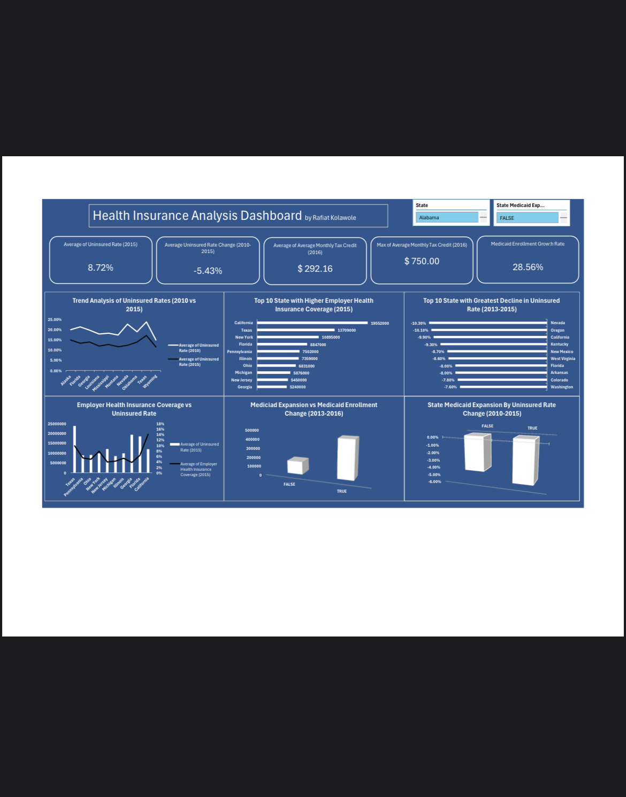

# U.S. Health Insurance Coverage Analysis (ACA Impact)

## Project Overview
This project analyzes health insurance data across all U.S. states to assess the impact of the Affordable Care Act (ACA) on insurance coverage, affordability, and Medicaid enrollment.

The analysis focuses on trends before and after ACA implementation, highlighting how policy decisions influenced insurance access nationwide.

## Tools Used
- Microsoft Excel
- Data Cleaning & Preparation
- Pivot Tables
- Dashboard Design
- KPI Development
- Trend & Comparative Analysis

## Objectives
- Evaluate changes in uninsured rates across U.S. states
- Compare outcomes between Medicaid expansion and non-expansion states
- Assess the role of marketplace tax credits in improving affordability
- Analyze growth in Medicaid enrollment following ACA implementation

## Key Insights
- Uninsured rates dropped significantly between **2010 and 2015**
- States that expanded Medicaid experienced the largest reductions in uninsured populations
- Marketplace tax credits improved affordability, with an average monthly credit of **$293**
- Medicaid enrollment increased by over **28%**, particularly in expansion states

## Conclusion
The analysis demonstrates that the Affordable Care Act played a significant role in expanding health insurance coverage and reducing financial barriers for millions of Americans. Policy-driven interventions proved effective in improving access to healthcare nationwide.

## Skills Demonstrated
- Data cleaning and preparation
- Pivot table analysis
- KPI creation
- Trend and comparative analysis
- Data storytelling through dashboards

## Dashboard Preview

